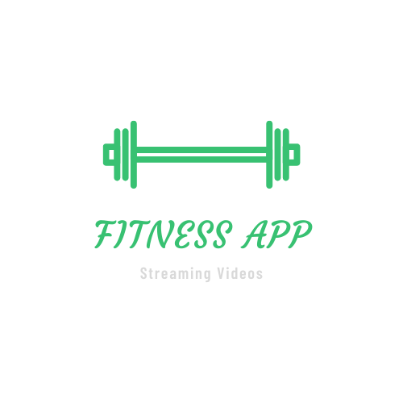

<p align="center">
    
</p>

<h3 align="center">
    🏋️‍♀️ Clean model for streaming video app
</h3>

<p align="center">
    
    
    <a href="https://github.com/KassiaMabily/Fitness-App/commits/master">
        
    </a>
    
</p>

<h4 align="center">
	🚧 Development 🚧
</h4>

<p align="center">
    <a href="#about">About</a> •
    <a href="#features">Features</a> •
    <a href="#how-it-works">How it works</a> • 
    <a href="#tech-stack">Tech Stack</a> • 
    <a href="#author">Author</a> • 
    <a href="#user-content-license">License</a>
</p>

<p align="center">
  <kbd>
    
  </kbd>
</p>

## 💻 Overview

The Fitness App is for personal trainers publish yours videos for streaming and payment with Stripe

---
## ✅ Features

- [x] Cast video with chromecast (Android)
- [x] Cast video with Airplay (iOS)
- [x] Video plays in background mode
- [ ] Web application for:
    - [ ] Register user
    - [ ] Payment to have acess to mobile app
- [ ] API with Django Rest Framework:
    - [ ] Register user
    - [ ] Process payments and provide access for users
    - [ ] Consulting programs, lessons and videos

---

## ⚙️ How it works

This project is divided into three parts:
1. Backend (server folder)
2. Frontend (client folder)
    - Web (web folder)
    - Mobile (mobile folder)

Both Frontend and Mobile need the Backend to be running to work.

### 👉 Pre-requisites

Before you begin, you will need to have the following tools installed on your machine:
[Git](https://git-scm.com), [Node.js](https://nodejs.org/en/), [Python](https://www.python.org/)
In addition, it is good to have an editor to work with the code like [VSCode](https://code.visualstudio.com/).

For a complete instruction to setting up the development environment mobile, please read the [docs](https://reactnative.dev/docs/environment-setup)

### 👉 Run Backend (server)
We still don't have a backend yet, so we use a [JSON Server](https://github.com/typicode/json-server) to get a full fake REST API

```bash

# Clone this repository
$ git clone git@github.com:KassiaMabily/Fitness-App.git

# go to the server folder
$ cd server

# Run server at your port
$ json-server --host <YOUR-IP> ./server/server.json -w -d 750 -p 3333

# The server will start at port: 3333 - go to http://<your-ip>:3333

```

### 👉 Running the mobile application

```bash

# Clone this repository
$ git clone git@github.com:KassiaMabily/Fitness-App.git

# Go to the Front End application folder
$ cd client/mobile

# Install the dependencies
$ yarn install

# Run the application in Android
$ npx react-native run-ios

# Run the application in iOS
$ npx react-native run-android

```

## 🚀 Tech Stack

The following tools were used in the construction of the project:

#### [](https://github.com/tgmarinho/Ecoleta#mobile-react-native--typescript)**Mobile**  ([React Native](http://www.reactnative.com/)  +  [TypeScript](https://www.typescriptlang.org/))

-   **[React Navigation](https://reactnavigation.org/)**
-   **[React Native Video](https://github.com/react-native-video/react-native-video)**
-   **[React Native Google Cast](https://github.com/react-native-google-cast/react-native-google-cast)**
-   **[Axios](https://github.com/axios/axios)**
-   **[React Native Vector Icons](https://github.com/oblador/react-native-vector-icons)**
-   **[React Native Iphone X Helper](https://github.com/ptelad/react-native-iphone-x-helper)**
-   **[Lottie](https://github.com/lottie-react-native/lottie-react-native)**

> See the file  [package.json](https://github.com/KassiaMabily/Fitness-App/blob/master/client/mobile/package.json)

#### [](https://github.com/KassiaMabily/Fitness-App#utilit%C3%A1rios)**Utilitários**

-   Editor:  **[Visual Studio Code](https://code.visualstudio.com/)**
-   API Test:  **[Insomnia](https://insomnia.rest/)**
-   Icons:  **[Feather Icons](https://feathericons.com/)**,  **[Font Awesome](https://fontawesome.com/)**
-   Fonts:  **[Barlow](https://fonts.google.com/specimen/Barlow)**,  **[Courgette](https://fonts.google.com/specimen/Courgette)**


---

## Authors
<table>
  <tr>
    <td align="center">
<p>
<a href="#">
 
 <br />
 <sub><b>Kassia Fraga</b></sub></a><a href="#" title="Kassia Fraga"></a>
 <br />
 <sub>Fullstack 👩‍💻</sub>
<br/>

[](https://www.linkedin.com/in/kassia-fraga-178b7b1a7/) 
[](https://www.instagram.com/kassia.mabily/)
[](mailto:kassiafraga7@gmail.com)
</p>
</td>
<td align="center">
<p>
<a href="#">
 
 <br />
 <sub><b>Patrick Souza</b></sub></a><a href="#" title="Patrick Souza"></a>
 <br />
 <sub>Backend 👨‍💻</sub>
 <br />

[](https://www.linkedin.com/in/patrick-felipe-323057150/) 
[](https://www.instagram.com/patrick.souza54/)
[](mailto:souza.felipe.patrick@gmail.com)
</p>
</td>
  </tr>
</table>

---

## 📝 Licença

Este projeto esta sobe a licença [MIT](./LICENSE).

Feito com ❤️ por Kassia e Patrick